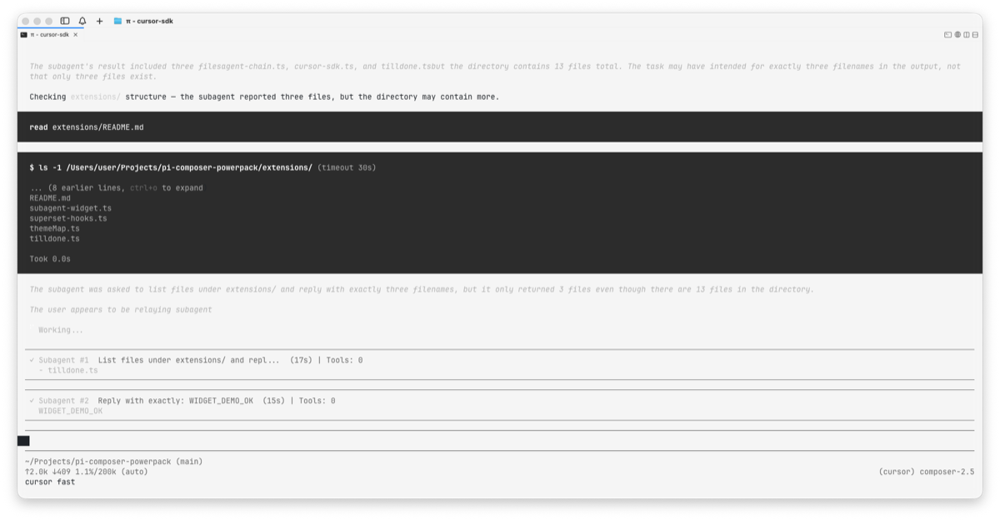
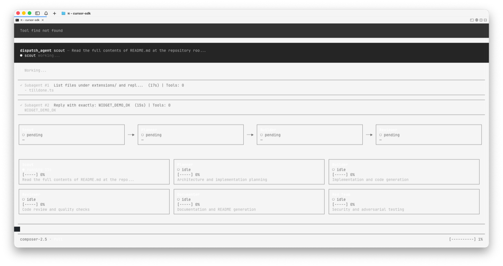
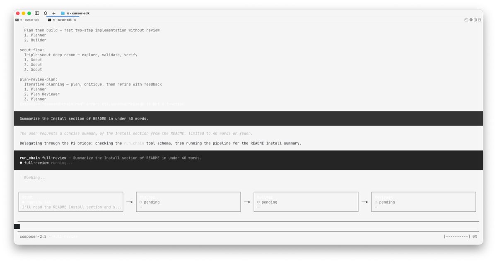

# Pi Composer Powerpack

[](https://github.com/kartikkabadi/pi-composer-powerpack/actions/workflows/ci.yml)
[](LICENSE)
[](https://github.com/kartikkabadi/pi-composer-powerpack)

**Cursor Composer 2.5 multi-agent workflows for [Pi](https://github.com/badlogic/pi-mono)** — chains, dispatch teams, Pi-Pi experts, live subagents, same-machine messaging, and damage-control safety in the terminal.

For developers on **Pi ≥ 0.75.3** who want Composer fast mode with opinionated orchestration, not a separate IDE extension.

## Quick start

### Install

Requires Pi **≥ 0.75.3** (see [Troubleshooting](docs/troubleshooting.md#install-and-startup) if install fails).

```bash
pi install https://github.com/kartikkabadi/pi-composer-powerpack
pi --model cursor/composer-2.5 --cursor-fast
```

The package bundles `pi-cursor-sdk@0.1.16` as a dependency, so the Cursor provider installs with the powerpack. No `install.sh`, shell launchers, or second manual npm step.

## Authentication

Composer runs through [pi-cursor-sdk](https://github.com/fitchmultz/pi-cursor-sdk). Before your first real session:

1. Start Pi with the commands above.
2. Run `/login` and follow the prompts to store a **Cursor API key** in your Pi profile.
3. Confirm the model: `pi --model cursor/composer-2.5 --cursor-fast`

If models appear in the picker but runs fail immediately, you usually need `/login` or a valid API key. See [docs/troubleshooting.md](docs/troubleshooting.md).

## What installs automatically

| Extension | Loaded on `pi install` | Behavior |
|-----------|------------------------|----------|
| `cursor-sdk` | Yes | `cursor/*` provider (re-exports pi-cursor-sdk) |
| `damage-control-continue` | Yes | Tool guardrails; bundled rules in `config/` |
| `subagent-widget` | Yes | `/sub`, `/subcont`, `/subrm`, `/subclear` |
| `coms` | Yes | Same-machine Pi-to-Pi messaging (`/coms`) |
| `agent-chain` | Yes (dormant) | Pipeline dispatcher — opt in with `/chain-mode` |
| `agent-team` | Yes (dormant) | Team dispatcher — opt in with `/agents-mode` |
| `pi-pi` | Yes (dormant) | Pi extension experts — opt in with `/pi-pi-mode` |

**Dormant** means the extension is installed but does not restrict tools or change the system prompt until you run the activation command.

Optional extensions shipped in-repo but **not** auto-loaded: `tilldone`, `auto-caveman`, `superset-hooks`. See [docs/extensions.md](docs/extensions.md).

## Workflow commands

Workflow extensions are available after install; they do not take over the session until you opt in.

### Chain pipeline (`agent-chain`)

| Command | Description |
|---------|-------------|
| `/chain-mode` | Dispatcher mode — only `run_chain` is available |
| `/chain-run <task>` | Hint to run the active chain on a task |
| `/chain` | Switch active chain |
| `/chain-list` | List bundled and project chains |
| `/direct` | Leave chain mode — restore full tools |

### Agent team (`agent-team`)

| Command | Description |
|---------|-------------|
| `/agents-mode` | Activate team dispatcher (`dispatch_agent` only) |
| `/agents-off` | Deactivate team dispatcher |
| `/agents-team` | Switch team |
| `/agents-list` | List agents in the active team |
| `/agents-grid <1-6>` | Set dashboard column count |

### Pi-Pi experts (`pi-pi`)

| Command | Description |
|---------|-------------|
| `/pi-pi-mode` | Activate Pi extension/config expert mode |
| `/pi-pi-off` | Leave Pi-Pi mode |
| `/experts` | List experts and status |
| `/experts-grid <1-5>` | Set expert grid columns |

### Always-on helpers

| Command | Description |
|---------|-------------|
| `/sub <task>` | Spawn a background subagent (widget UI) |
| `/subcont`, `/subrm`, `/subclear` | Continue, remove, or clear subagents |
| `/coms` | Refresh or filter the peer-agent pool |

Bundled agents, teams, chains, and Pi-Pi experts live in [`agents/`](agents/). Project files under `.pi/agents/` can override or extend them.

## Bundled assets

### Chains ([`agents/agent-chain.yaml`](agents/agent-chain.yaml))

| Chain | Flow |
|-------|------|
| `full-review` (default) | scout → planner → builder → reviewer |
| `plan-build-review` | planner → builder → reviewer |
| `plan-build` | planner → builder |
| `scout-flow` | scout → scout → scout |
| `plan-review-plan` | planner → plan-reviewer → planner |

Set default chain: `PI_DEFAULT_CHAIN=plan-build-review`.

### Teams ([`agents/teams.yaml`](agents/teams.yaml))

`full`, `plan-build`, `info`, `frontend`, `pi-pi`

### Agents

8 general agents (`scout`, `planner`, `builder`, …) plus 9 Pi-Pi experts under [`agents/pi-pi/`](agents/pi-pi/) (`pi-orchestrator` is the orchestrator prompt, not a dispatch target).

### Theme

[`themes/mono-black.json`](themes/mono-black.json) — installed with the package.

## Environment variables

| Variable | Purpose |
|----------|---------|
| `PI_DEFAULT_CHAIN` | Default chain name (default: `full-review`) |
| `PI_CHAIN_ENFORCE` | Set to `1` to force `run_chain` on the last user message |
| `PI_POWERPACK_BOOT_NOTICES` | Set to `1` for extra startup command hints |
| `PI_CODING_AGENT_DIR` | Pi agent home (default: `~/.pi/agent`) |
| `PI_SUBAGENT_MODEL` | Model for spawned subagents (default: `cursor/composer-2.5`) |
| `PI_SUBAGENT_CURSOR_FAST` | Set to `0` to disable `--cursor-fast` on subagents |
| `PI_CURSOR_SDK_EXTENSION` | Path to cursor-sdk extension override |
| `PI_POWERPACK_PI` / `PI_BIN` | `pi` binary path override |
| `PI_COMS_DIR` | Coms socket/registry directory |
| `PI_CAVEMAN_SKILL_PATH` | Skill file for opt-in `auto-caveman` extension |

## Preview

| Subagents (`/sub`) | Team grid (`/agents-mode`) | Chain pipeline (`/chain-mode`) |
|---|---|---|
|  |  |  |

## Verify

From a maintainer checkout:

```bash
sfw pnpm run check:secrets
sfw pnpm run pack:dry
```

After installing into a Pi profile:

```bash
pi --model cursor/composer-2.5 --cursor-fast --no-session --no-tools -p "Reply exactly OK"
```

Expected response: `OK`

## Safety

This repo intentionally excludes Pi session files, auth files, API keys, memory databases, socket files, and private machine-wide configs. Run `npm run check:secrets` before publishing.

## Related projects

- [pi-cursor-sdk](https://github.com/fitchmultz/pi-cursor-sdk) — Cursor provider for Pi (bundled here)
- [Pi coding agent](https://github.com/badlogic/pi-mono) — terminal agent this package extends

This powerpack adds orchestration, agents, themes, and safety on top of the SDK — install the SDK alone if you only need the provider.

## Docs

- [Architecture](docs/architecture.md)
- [Troubleshooting](docs/troubleshooting.md)
- [Optional extensions](docs/extensions.md)
- [Contributing](CONTRIBUTING.md)
- [Changelog](CHANGELOG.md)
- [Security](SECURITY.md)

## License

[MIT](LICENSE) — Copyright (c) 2026 Kartik Kabadi
